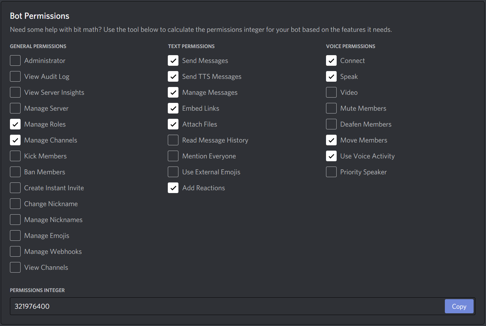

# TellME
> Voice-Assistant based Improv + Chinese-Whispers concept

Example session recording based on the `basic` ruleset provided.

## Installation

Ensure [Python3.7](https://python.org/) is installed. Tentatively, Python3.8 should work, but because Tensorflow is awkward we can't just blanket say "Python3.7 or later", since 3.9 doesn't work until (hopefully) Tensorflow 2.5.

Install [Poetry](https://python-poetry.org/), open the `$ poetry shell` in the project directory (handles `venv` etc.), and use `$ poetry install`.

Install `libopus0`/`libopus` (depending on system) and `ffmpeg`.

Have a `token.txt` file available that has your Discord Bot token, and an `owner.txt` file with your Discord User ID.

Naturally, the bot needs to be invited to the server. Currently, these are the expected permissions (321976400):



## Running

While in the poetry shell, use `$ poetry run python3 tellme.py`

The bot is online and, if connected to your server, will login. Type `!play` when all players are in voice-chat with you and the game will commence. (TEMP: Assumes roles and channel names, a todo is to have the bot perform all setup)

***

### Citing TellMe

```bib
@misc{
  author={Ibrahim Al-Jeffery, Alex Blandin, Adam Cook, Ibukun Olatunji, Simon Robinson},
  title={{TellMe -- Voice-Assistant based Improv}},
  url = {https://github.com/AlexBlandin/TellMe},
  howpublished = {{available} at \url{https://github.com/AlexBlandin/TellMe}}
}
```

***

### Style-guide for pull requests

- Strings use `"`, not `'`, such as `"hello, world"`
  - Alex is a C programmer, `'` means a single character to them
- f-strings `f"` are preferred and superior, `.format()` only if absolutely necessary
  - `'` are allowed in f-strings to aid nesting / avoid `f"""` everywhere, nowhere else
- Indentation is 2-space, non-mixed, avoid tab characters or Python will crash
- Please have a space after any comments, `# NOTE:` is more readable than `#NOTE:`
- That's it, really, we just like a little consistency and cleanliness
